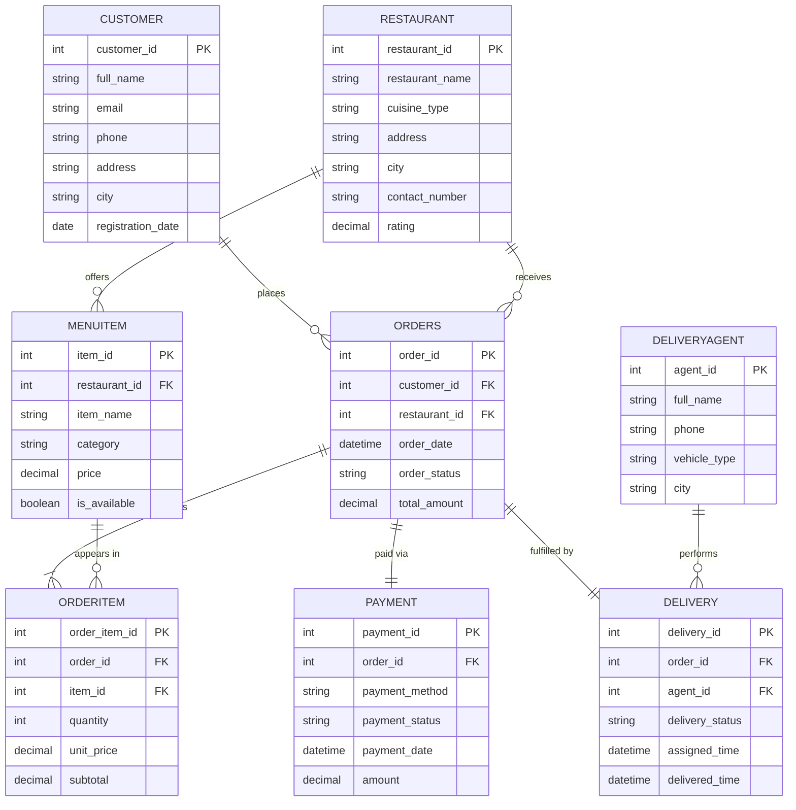

# Entity-Relationship Diagram — Online Food Ordering System

## Overview

The system models eight core entities: **Customer, Restaurant, MenuItem,
Orders, OrderItem, Payment, DeliveryAgent,** and **Delivery**. `OrderItem`
is an associative (junction) entity that resolves the many-to-many
relationship between `Orders` and `MenuItem`. `Payment` and `Delivery` are
weak dependents of `Orders`, each in a strict 1:1 relationship with it.

## Entity — Attribute — Key Summary

| Entity         | Key Attributes                                              | Primary Key     | Foreign Keys                                  |
|----------------|---------------------------------------------------------------|------------------|-------------------------------------------------|
| Customer       | customer_id, full_name, email, phone, address, city, registration_date | customer_id     | —                                                |
| Restaurant     | restaurant_id, restaurant_name, cuisine_type, address, city, contact_number, rating | restaurant_id | —                                          |
| MenuItem       | item_id, restaurant_id, item_name, category, price, is_available | item_id         | restaurant_id → Restaurant                       |
| Orders         | order_id, customer_id, restaurant_id, order_date, order_status, total_amount | order_id  | customer_id → Customer, restaurant_id → Restaurant |
| OrderItem      | order_item_id, order_id, item_id, quantity, unit_price, subtotal | order_item_id  | order_id → Orders, item_id → MenuItem            |
| Payment        | payment_id, order_id, payment_method, payment_status, payment_date, amount | payment_id | order_id → Orders (UNIQUE)                     |
| DeliveryAgent  | agent_id, full_name, phone, vehicle_type, city                | agent_id        | —                                                |
| Delivery       | delivery_id, order_id, agent_id, delivery_status, assigned_time, delivered_time | delivery_id | order_id → Orders (UNIQUE), agent_id → DeliveryAgent |

## Relationships & Cardinalities

| Relationship                          | Cardinality | Description                                              |
|----------------------------------------|-------------|------------------------------------------------------------|
| Customer places Orders                 | 1 : N       | One customer can place many orders; each order has one customer |
| Restaurant receives Orders             | 1 : N       | One restaurant can receive many orders; each order belongs to one restaurant |
| Restaurant offers MenuItem              | 1 : N       | One restaurant has many menu items; each menu item belongs to one restaurant |
| Orders contains OrderItem              | 1 : N       | One order can have many order lines; each order line belongs to one order |
| MenuItem appears in OrderItem          | 1 : N       | One menu item can appear in many order lines across different orders |
| Orders has Payment                     | 1 : 1       | Each order has exactly one payment record                 |
| Orders has Delivery                    | 1 : 1       | Each order has exactly one delivery record                |
| DeliveryAgent performs Delivery        | 1 : N       | One agent can perform many deliveries over time            |

*(Orders and MenuItem are in a many-to-many relationship in real-world*
*terms, resolved through the associative entity OrderItem — giving*
*Orders : OrderItem = 1:N and MenuItem : OrderItem = 1:N.)*

## Mermaid ER Diagram

## Notes on Normalization

- **1NF:** All attributes hold atomic values; no repeating groups (e.g., an
  order's items are stored as separate `OrderItem` rows, not a comma-separated
  list).
- **2NF:** Every non-key attribute is fully functionally dependent on the
  whole primary key — relevant chiefly in `OrderItem`, where `quantity` and
  `unit_price` depend on the full combination of the order line, not a
  partial key.
- **3NF:** No transitive dependencies exist. For example, `total_amount` in
  `Orders` is a derived/cached summary field (common in transactional
  systems for performance) rather than something `order_status` depends on;
  restaurant `city`/`address` live only in `Restaurant`, not duplicated
  into `Orders` or `MenuItem`.
